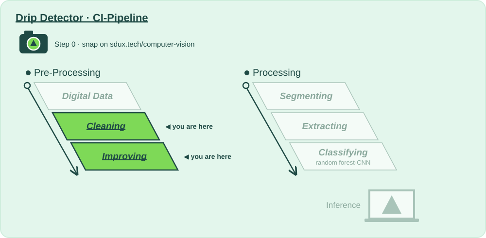

# CI Stage: Image Preprocessing Methods

## Why?

📍 **Where we are:** Pre-Processing, stages 2 and 3: **Cleaning** and **Improving**, right after Digital Data.
On the layer diagram: Natural Scene → Digital Data → **Preparing for Analysis** → Model Training → Inference.

The clip-on camera costs a few euros, and it shows: sensor noise, dead pixels, JPEG blocks, blur. At night on the ward, frames are so dim that everything sits in a narrow band of grey. And the thing we care about, a falling drop, is only a few pixels tall.

**Cleaning** removes what the camera added without removing the drop. **Improving** stretches the dark frames back out and finds the edges. Both answer the same question for the rest of the pipeline: can we trust these pixels?

**Without this stage:** segmentation mistakes noise for drops, and the night shift sees nothing at all.

| | |
|---|---|
| 📅 Lecture | Thu 24.09 |
| 🛠 How? | [`cleaning_denoise/action.yaml`](cleaning_denoise/action.yaml) · [`improving_enhance/action.yaml`](improving_enhance/action.yaml) — the 🎛️ tinker zone |
| 📋 What? | [`Todo_Cleaning.md`](Todo_Cleaning.md) · [`Todo_Improving.md`](Todo_Improving.md) — Step 0 to Step 3 |
| 📓 Go deeper | [`cleaning.ipynb`](cleaning.ipynb) · [`improving.ipynb`](improving.ipynb) |

⬅️ [Back to the whole pipeline](../README.md)
