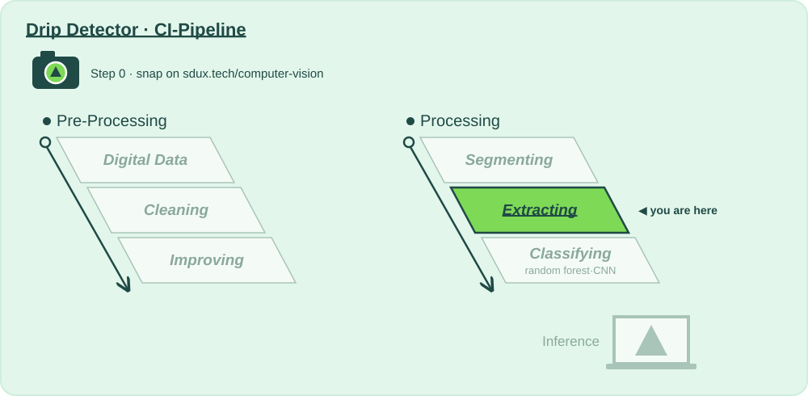

# CI Stage: Feature Extraction and Data Preparation

## Why?

📍 **Where we are:** Processing, stage 5: **Extracting**, the last step before a model sees anything.
On the layer diagram: Natural Scene → Digital Data → **Preparing for Analysis** → Model Training → Inference.

A random forest can't look at a picture. It needs numbers that mean something: which way the edges point (HOG) and which textures sit where (LBP). This stage turns 16 384 pixels into a few thousand meaningful numbers and puts them all on the same scale.

A startup never has enough labelled data, so we also invent extra training frames with augmentation. Two rules keep us honest: augment the training set only, and fit the scaler on training data only. Break them and the test score lies, and you'll find out in the hospital instead of in CI.

**Without this stage:** the model gets 16 384 raw numbers per frame and 270 examples to learn from.

| | |
|---|---|
| 📅 Lecture | Thu 01.10 |
| 🛠 How? | [`extracting_describe/action.yaml`](extracting_describe/action.yaml) — the 🎛️ tinker zone |
| 🧪 Recipe | [`extracting_describe/recipe.py`](extracting_describe/recipe.py) — the maths CI runs, yours to change |
| 🧪 Sandboxes | [`extracting_describe/sandboxes/`](extracting_describe/sandboxes/) — HOG, LBP, scaling, augmentation on real frames: ▶ in PyCharm |
| 📋 What? | [`Todo_Extracting.md`](Todo_Extracting.md) — Step 0 to Step 3 |
| 📓 Go deeper | [`extracting.ipynb`](extracting.ipynb) |

⬅️ [Back to the whole pipeline](../README.md)
