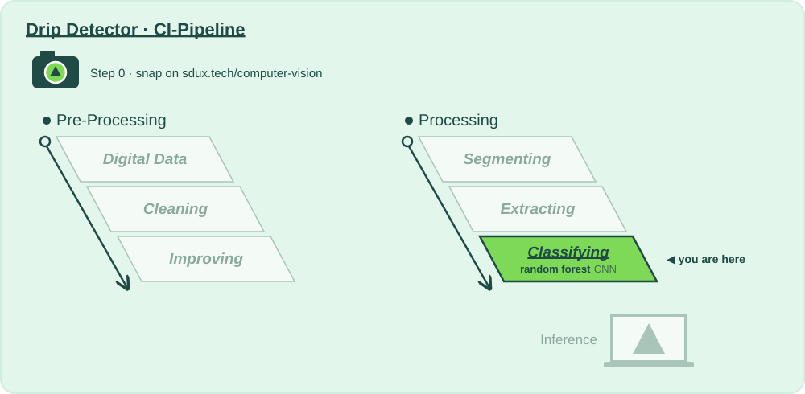

# CI Stage: Image Classification with Random Forests

## Why?

📍 **Where we are:** Processing, stage 6: **Classifying**, with a random forest.
On the layer diagram: Natural Scene → Digital Data → Preparing for Analysis → **Model Training** → Inference.

Here the startup's question finally gets an answer: is the infusion running, stopped, or about to run dry?

A random forest learns from the features and is graded only on the test set we locked on day one. In a hospital accuracy alone isn't enough: missing a chamber that runs dry is worse than a false alarm. So we read the confusion matrix and check the recall of every class. Your snap gets its first real prediction here.

**Without this stage:** all that preparation produces pictures, but no decision.

| | |
|---|---|
| 📅 Lecture | Tue 06.10 |
| 🛠 How? | [`classifying_random-forest/action.yaml`](classifying_random-forest/action.yaml) — the 🎛️ tinker zone |
| 🧪 Recipe | [`classifying_random-forest/recipe.py`](classifying_random-forest/recipe.py) — the model CI trains, yours to change |
| 🧪 Sandboxes | [`classifying_random-forest/sandboxes/`](classifying_random-forest/sandboxes/) — one tree, the forest, the vote, the exam: ▶ in PyCharm |
| 📋 What? | [`Todo_Classifying.md`](Todo_Classifying.md) — Step 0 to Step 3 |
| 📓 Go deeper | [`random-forest.ipynb`](random-forest.ipynb) |

⬅️ [Back to the whole pipeline](../README.md)
