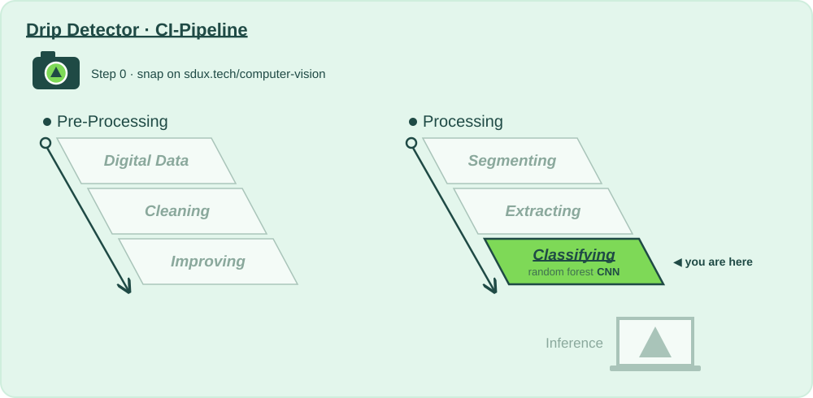

# CI Stage: Image Classification with Neural Networks

## Why?

📍 **Where we are:** Processing, stage 6: **Classifying**, with a convolutional neural network running next to the forest.
On the layer diagram: Natural Scene → Digital Data → Preparing for Analysis → **Model Training** → Inference.

The forest only sees what we told it to look at in stage 5. A convolutional neural network learns its own filters, straight from the segmented pixels.

Both run in the same pipeline, so every run is a head-to-head. Out of the box, on 360 frames, the network loses (about 79 % against 97 %). Why, and what it would take to win, is this week's lesson: data, overfitting, and why graphics cards changed everything.

**Without this stage:** we never find out whether the modern approach is actually better for *our* product.

| | |
|---|---|
| 📅 Lecture | Thu 08.10 |
| 🛠 How? | [`classifying_cnn/action.yaml`](classifying_cnn/action.yaml) — the 🎛️ tinker zone |
| 📋 What? | [`Todo_Classifying.md`](Todo_Classifying.md) — Step 0 to Step 3 |
| 📓 Go deeper | [`neural-network.ipynb`](neural-network.ipynb) |

⬅️ [Back to the whole pipeline](../README.md)
