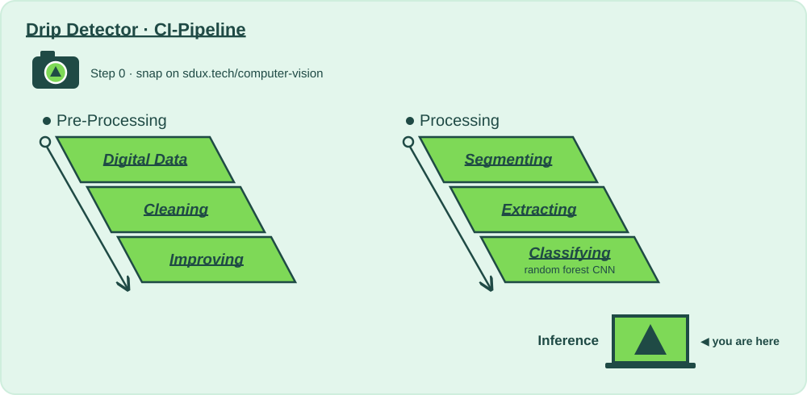

# CI Stage: Course Summary

## Why?

📍 **Where we are:** The whole pipeline, and its last layer: **Inference**, the laptop at the bottom of the slide.
On the layer diagram: Natural Scene → Digital Data → Preparing for Analysis → Model Training → **Inference**.

Inference is the moment that matters: a model makes a call on a frame it has never seen, and a nurse gets told.

Demo Day collects every stage's metrics, gates and previews into one page, shows your snap's journey from camera to prediction, and sends the final webhook to the sdux.tech page. It's what you show the investors on Tuesday 13.10, and the exam on Thursday 15.10 walks the same pipeline: why, how and what, stage by stage.

**Without this stage:** a pile of green checkmarks that nobody outside the team understands.

| | |
|---|---|
| 📅 Lecture | Tue 13.10 · exam Thu 15.10 |
| 🛠 How? | [`demo-day_report/action.yaml`](demo-day_report/action.yaml) — the 🎛️ tinker zone |
| 📋 What? | [`Todo_Demo-Day.md`](Todo_Demo-Day.md) — Step 0 to Step 3 |

⬅️ [Back to the whole pipeline](../README.md)
