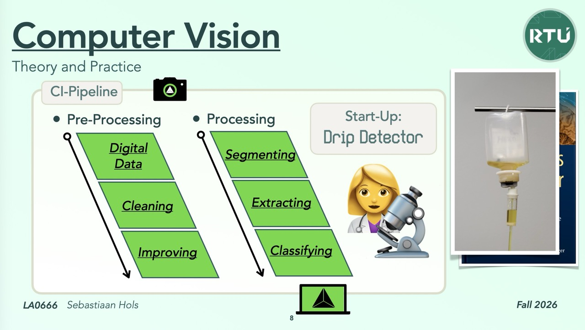

# 🚀 Drip Detector — a computer-vision startup in a CI-pipeline

**LA0666 Computer Vision · RTU Liepāja · Fall 2026**

Imagine we're a startup. Our product is a clip-on camera for an IV drip chamber that tells the nurse when an infusion **stops** or is about to **run dry**. Every lecture adds one stage to the product's CI-pipeline, and every push shows whether the product got better or worse.

<p align="center"></p>

<p align="center"></p>

## How this repository works

Every topic of the week has its own folder, and every folder answers the same three questions:

| | File | Answers |
|---|---|---|
| **Why?** | `<topic>/README.md` | Where we are on the Drip Detector pipeline, and why the startup needs this stage |
| **How?** | `<topic>/<stage>_<action>/action.yaml` | The stage as a GitHub Action, annotated: a 🎛️ **tinker zone** with every value you may change (and the mathematician who thought of it), a 🚦 **gate zone** with the promises the stage keeps, and 🔒 plumbing you can ignore |
| | `<topic>/<stage>_<action>/recipe.py` | 🧪 The maths CI runs, one frame in, one frame out. Yours to change |
| | `<topic>/<stage>_<action>/sandboxes/` | 🧪 One sub-step of the recipe on one real frame: press ▶ in PyCharm and see the result in a second |
| **What?** | `<topic>/Todo_<Stage>.md` | What we do now, in four steps |

The four steps, with apologies to the Underpants Gnomes (*Step 1: collect underpants. Step 2: ? Step 3: profit.*):

* **Step 0 · Snap.** Take a picture on [sdux.tech/computer-vision](https://sdux.tech/computer-vision?repo=DreamEmulator/rtu-computer-vision) and upload it into your pipeline. The page shows every webhook as it fires: what happened to your image in each stage, error messages and performance.
* **Step 1 · Input.** Take the output of the previous stage.
* **Step 2 · Check, improve and play.** Tinker, push, and enjoy the visual results.
* **Step 3 · Analyse and decide.** The gates decide whether we're ready to pass on to the next stage.

## The topics

| | Topic of the week | Lecture | How? | What? | Go deeper |
|---|---|---|---|---|---|
| 📷 | [01 · Introduction to Image Processing](01_image-processing/) | Tue 22.09 | [digital-data_prepare](01_image-processing/digital-data_prepare/action.yaml) | [Todo](01_image-processing/Todo_Digital-Data.md) | [](https://colab.research.google.com/github/DreamEmulator/rtu-computer-vision/blob/main/01_image-processing/digital-data.ipynb) |
| 🧽🔆 | [02 · Image Preprocessing Methods](02_image-preprocessing/) | Thu 24.09 | [cleaning_denoise](02_image-preprocessing/cleaning_denoise/action.yaml) · [improving_enhance](02_image-preprocessing/improving_enhance/action.yaml) | [Cleaning](02_image-preprocessing/Todo_Cleaning.md) · [Improving](02_image-preprocessing/Todo_Improving.md) | [](https://colab.research.google.com/github/DreamEmulator/rtu-computer-vision/blob/main/02_image-preprocessing/cleaning.ipynb) [](https://colab.research.google.com/github/DreamEmulator/rtu-computer-vision/blob/main/02_image-preprocessing/improving.ipynb) |
| ✂️ | [03 · Image Segmentation](03_image-segmentation/) | Tue 29.09 | [segmenting_threshold](03_image-segmentation/segmenting_threshold/action.yaml) | [Todo](03_image-segmentation/Todo_Segmenting.md) | [](https://colab.research.google.com/github/DreamEmulator/rtu-computer-vision/blob/main/03_image-segmentation/segmenting.ipynb) |
| 🧬 | [04 · Feature Extraction and Data Preparation](04_feature-extraction/) | Thu 01.10 | [extracting_describe](04_feature-extraction/extracting_describe/action.yaml) | [Todo](04_feature-extraction/Todo_Extracting.md) | [](https://colab.research.google.com/github/DreamEmulator/rtu-computer-vision/blob/main/04_feature-extraction/extracting.ipynb) |
| 🌳 | [05 · Image Classification with Random Forests](05_random-forests/) | Tue 06.10 | [classifying_random-forest](05_random-forests/classifying_random-forest/action.yaml) | [Todo](05_random-forests/Todo_Classifying.md) | [](https://colab.research.google.com/github/DreamEmulator/rtu-computer-vision/blob/main/05_random-forests/random-forest.ipynb) |
| 🧠 | [06 · Image Classification with Neural Networks](06_neural-networks/) | Thu 08.10 | [classifying_cnn](06_neural-networks/classifying_cnn/action.yaml) | [Todo](06_neural-networks/Todo_Classifying.md) | [](https://colab.research.google.com/github/DreamEmulator/rtu-computer-vision/blob/main/06_neural-networks/neural-network.ipynb) |
| 🎤 | [07 · Course Summary](07_course-summary/) | Tue 13.10 | [demo-day_report](07_course-summary/demo-day_report/action.yaml) | [Todo](07_course-summary/Todo_Demo-Day.md) | |

The random forest and the neural network run side by side after Extracting. The network is switched off until Thursday 08.10 (`enabled` in its tinker zone). Exam: Thu 15.10.

## ❓ How To's

Questions that cross every stage, answered step by step, with forks for what you might see on the way. [All How To's](how-to/)

| ❓ How to… | |
|---|---|
| [add my own classes?](how-to/add-my-own-classes.md) | 🎬 film → frames → `data/raw/` → an honest test set |
| [train our model on cows?](how-to/train-our-model-on-cows.md) | 🔍 read the mistakes, find the stage at fault, fix one thing |
| [pick which model I am training?](how-to/pick-which-model-i-am-training.md) | ⚖️ forest, SVM, kNN or network, with numbers |
| [export a tflite file from our pipeline?](how-to/export-a-tflite-file.md) | 📱 a model for a phone, and the catch nobody mentions |

## Getting started (students)

1. Click **Use this template → Create a new repository**. Make it public if you want the Colab buttons to work.
2. Open the **Actions** tab. The first run starts by itself and takes a few minutes. A small *Template init* job also points every link at your own copy.
3. Open the run and read the summary: one section per stage with metrics, performance, gates, a download link for `preview.png`, and links to that stage's tinker zone, Todo and notebook.
4. Run an experiment:
   ```bash
   git switch -c experiment/median-filter
   # change ONE value in a tinker zone, e.g. 02_image-preprocessing/cleaning_denoise/action.yaml
   git commit -am "Cleaning: median kernel 5" && git push -u origin HEAD
   ```
   Open a pull request. CI runs on it, and the PR template asks for your hypothesis and the Demo Day numbers of `main` against your branch. That's Step 3.

Working locally in **PyCharm**: open the folder and give it its own interpreter (Settings → Project → Python Interpreter → Add Interpreter → Add Local Interpreter → Virtualenv in `.venv`), then open `requirements-dev.txt` and click *Install requirements*. The run menu next to ▶ already lists the sandboxes, the recipes and the pipeline (from `.run/`). Working locally in a terminal or in a Codespace (the repository includes a dev container):

```bash
pip install -r requirements-dev.txt          # add requirements-cnn.txt for the neural network
python run_pipeline.py                       # every stage, same code and same tinker-zone values as CI
python run_pipeline.py --snap photo.jpg      # Step 0 without the page: your photo through every stage
python run_pipeline.py --from segmenting     # re-run from a stage (slide numbers work too: --from 4)
jupyter lab                                  # notebooks live in the topic folders
```

## Taking it for real: your own subject

The pipeline doesn't know it's looking at drips. Put your frames in one folder per class and set `source: "folder"` in the tinker zone of [Digital Data](01_image-processing/digital-data_prepare/action.yaml). See [data/raw/README.md](data/raw/README.md), or follow [How to add my own classes?](how-to/add-my-own-classes.md) from video to green gates. Then retune stage by stage; the gates tell you where your data differs from ours.

## For the lecturer

1. Push this repository to GitHub and tick **Settings → General → Template repository**. The Colab links point at `DreamEmulator/rtu-computer-vision`, so they work here; *Template init* rewrites them to each student's own repository.
2. **Step 0 page.** [docs/step-0-snap.md](docs/step-0-snap.md) is the contract for sdux.tech/computer-vision: how to start a pipeline with a photo, the webhook events with real example payloads, and signature checks. In each student repository: variable `CV_WEBHOOK_URL`, secret `CV_WEBHOOK_SECRET`, and your GitHub App installed. `python -m tools.webhook_receiver` stands in for the page while you build it.
3. Optional: publish Demo Day as a website with **Settings → Pages → Source: GitHub Actions** and the repository variable `ENABLE_PAGES = true`.
4. The pictures in each README come from `python -m tools.make_pipeline_svg`; the notebooks are ordinary `.ipynb` files.

## What's where

```
01_image-processing/ … 07_course-summary/
  README.md                    ← Why?   where we are, and why the startup needs it
  <stage>_<action>/action.yaml ← How?   the stage as a composite action: tinker zone, gate zone, plumbing
  <stage>_<action>/recipe.py   ← 🧪     the maths CI runs (one frame in, one frame out)
  <stage>_<action>/sandboxes/  ← 🧪     one sub-step of the recipe on one real frame, ▶ in PyCharm
  Todo_<Stage>.md              ← What?  Step 0 snap → Step 1 input → Step 2 play → Step 3 decide
  <stage>.ipynb                ← go deeper, with the same functions CI runs
  pipeline.svg                 ← the "you are here" picture
.github/workflows/pipeline.yml ← the orchestrator: imports each stage with uses: ./<topic>/<stage>_<action>
.github/actions/               ← shared plumbing: setup, webhooks, artifacts
stages/                        ← the plumbing behind every stage (s1…s7), the sandboxes, the stage map and the webhook sender
.run/                          ← PyCharm run configurations: ▶ sandboxes, recipes and the pipeline
run_pipeline.py                ← run the stages locally
tools/                         ← synthetic dataset, frames from video, snap trigger, webhook receiver, pipeline pictures
how-to/                        ← ❓ How To's: questions that cross every stage
docs/step-0-snap.md            ← the contract for the sdux.tech page
data/raw/                      ← your own frames (source: folder)
```

Why a folder with an `action.yaml` inside, rather than a loose `<stage>_<action>.yaml`? GitHub only imports an action from a folder that contains an `action.yaml`, and only runs workflows from `.github/workflows/`.

## Troubleshooting

* **Nothing runs in my fork.** Forks start with Actions switched off: open the Actions tab and enable them. *Use this template* doesn't have this problem.
* **Template init failed with a permission error.** Settings → Actions → General → Workflow permissions → *Read and write*, then re-run it from the Actions tab.
* **A stage is red.** That's a gate doing its job. The red annotation names the gate and the tinker zone to tune; Demo Day still shows the stages that did run.
* **My snap doesn't show up on the page.** Check the repository variable `CV_WEBHOOK_URL`, and the *Tell the snap page…* steps in the run log: failed deliveries appear there as warnings.
* **The neural network takes longer.** TensorFlow is only installed when `enabled: "true"`; the first install takes a minute or two.
* **Colab can't clone the repository.** Colab needs a public repository. Use a Codespace or run locally for private ones.
